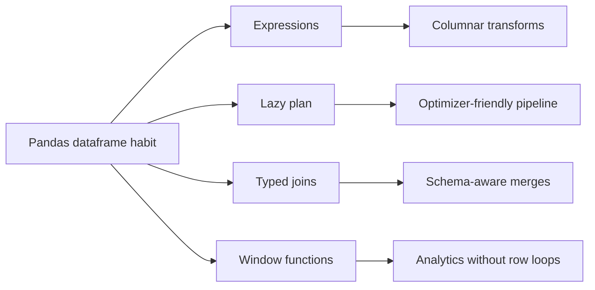

# Mental model map

Use this map when explaining the jump from mutable dataframe steps to query-plan thinking.

```mermaid
flowchart LR
  A["Pandas dataframe habit"] --> B["Expressions"]
  A --> C["Lazy plan"]
  A --> D["Typed joins"]
  A --> E["Window functions"]
  B --> F["Columnar transforms"]
  C --> G["Optimizer-friendly pipeline"]
  D --> H["Schema-aware merges"]
  E --> I["Analytics without row loops"]
```
